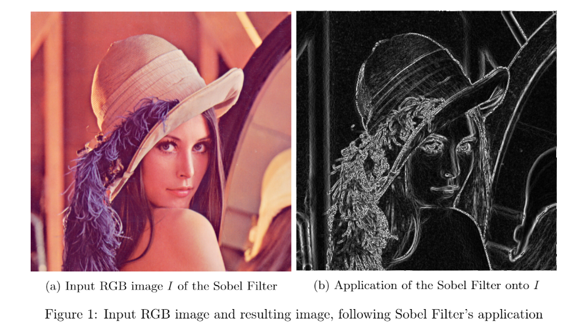

# Native C, CUDA, OpenCV implementations of the Sobel Filter 
## Course project for "Programming Tools for Parallel and Distributed Systems"
## University of Pisa
## Department of Computer Science
## Academic Year 2018-2019

### What is a Sobel Filter?

The Sobel Filter, also known as Sobel Operator, is an algorithm used in computer vision and image processing
for identifying regions characterised by sharp changes in intensity (i.e., edges).

For further information, please refer to [Sobel Operator](https://en.wikipedia.org/wiki/Sobel_operator)

For a report on the performance comparison between the Native C, CUDA, OpenCV versions of the Sobel Filter, please refer to the 'SPD_Project_Report_Daniele_Gadler_5_0.pdf' file in the present repository.



### Installation
The 'imagemagick' package is required for converting input PNG/JPG/GIF images to RGB format, an encoding-independent format taken as input by the present program. 

The present implementations work with  PNG, JPG and GIF input images. 

## 1 -  Dependencies
On Linux, run:
```sh
sudo apt-get install imagemagick
```
On a MAC, run:

```sh
brew install imagemagick
```

## 2 - Clone the repository

Just run the following commands to clone the repository

```sh
cd $HOME
git clone https://github.com/DanyEle/Sobel_Filter.git
```

## 3 - Run the native C version
In order to run the native C version, make sure you have the gcc compiler installed. We will now proceed to compile the project files and perform one run with an input image. 
```sh
cd $HOME
cd Sobel_Filter/Native_Sobel
./compile.sh
./Debug/Native_Sobel imgs_in/512x512.png
```
The 512x512.png image can be replaced by any other image (e.g.: 1024x512.png, 1024x1024.png, 2048x1024.png).
The output lies in the Sobel_Filter/Native_Sobel/imgs_out/ folder. 
If you would like to execute 10 runs of the native C Sobel Filter with a certain input image, then just run:
```sh
./run_experiments.sh <input_image>
```

## 4 - Run the OpenCV Version
In order to run the OpenCV version, make sure you have the g++ compiler and OpenCV installed. 
To quickly install OpenCV in Linux:
```sh
sudo apt-get install libopencv-dev
```
Now, to compile and run the OpenCV version, execute the following commands:
```sh
cd $HOME
cd Sobel_Filter/OpenCV_Sobel
./compile.sh
./Debug/OpenCV_Sobel imgs_in/512x512.png
```
The output lies in the Sobel_Filter/OpenCV_Sobel/imgs_out/ folder.
If you would like to execute 10 runs of the OpenCV Sobel Filter with a certain input image, then just run:
```sh
./run_experiments.sh <input_image>
```
## 5 - Run the CUDA Version
In order to run the CUDA version, make sure you have a CUDA-compatible GPU and its corresponding CUDA drivers, as well as the nvidia-cuda-toolkit to compile CUDA programs. 
To quickly install the NVIDIA-CUDA-Toolkit on Linux, just run:
```sh
sudo apt-get install nvidia-cuda-toolkit
```
Now, to compile and run the CUDA implementation, execute the following commands:
```sh
cd $HOME
cd Sobel_Filter/CUDA_Sobel
./compile.sh
./Debug/CUDA_Sobel imgs_in/512x512.png
```
The output lies in the Sobel_Filter/CUDA_Sobel/imgs_out/ folder. 
If you would like to execute 10 runs of the CUDA Sobel Filter with a certain input image, then just run:
```sh
./run_experiments.sh <input_image>
```

## 6 - CUDA with multiple pixels per thread

In order to run the CUDA version using multiple pixels per thread, just follow the instructions
for the plain CUDA version and run the following commands:

```sh
cd $HOME
cd Sobel_Filter/CUDA_Sobel_Block
./compile.sh
./Debug/CUDA_Sobel imgs_in/512x512.png 2
```
The output lies in the Sobel_Filter/CUDA_Sobel/imgs_out/ folder. 
If you would like to execute 10 runs of the CUDA Sobel Filter with a certain input image
and a certain amount of pixels per thread, then just run:
```sh
./run_experiments.sh <input_image> <amount_of_pixels>
```
 


